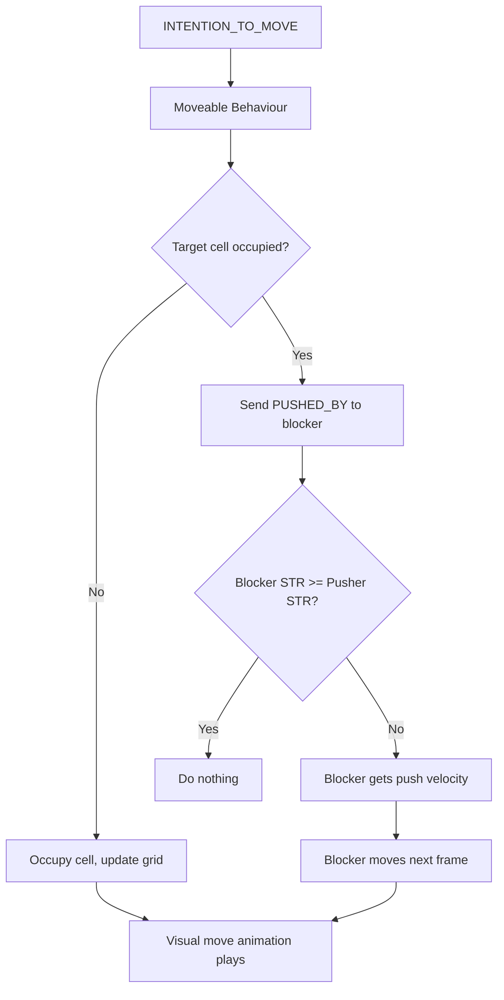

# 🧭 Movement, Animation, and Conflict Resolution — Oren RPG

## 🎯 Goals

- Maintain a discrete, grid-based logic system.
- Enable smooth, velocity-based visual movement.
- Allow asynchronous reactions to conflict (`PUSHED_BY`).
- Ensure no rollback is needed — game logic is committed instantly.

---

## 📦 Core Concepts

### CoordinateHolder

Each actor has:
- `coordinates: Vec2[int]` → Logical grid position (always exact).
- `velocity: Vec2[float]` → Intended direction and magnitude of movement.
- `movement_buffer: Vec2[float]` → Accumulated motion toward next cell.

Actors are **always logically on a single cell** — no partial occupancy.

---

## ⚙️ Movement Mechanics

### Movement Accumulation

- Velocity is accumulated over time using `delta_time`.
- When movement buffer crosses a full tile in an axis (x or y), an **attempt to occupy the next cell** is triggered.
- Grid position updates **immediately** on successful cell occupation.

```python
if movement_buffer.x >= tile_width:
    attempt_move_to(coordinates + Vec2(1, 0))
```

# Directional Speed Control
- Actors may have different movement speeds along the x/y axes.

- Velocity can reflect this (e.g., Vec2(200, 100) means "twice as fast horizontally").

# ⚔️ Conflict Resolution
## Cell Ownership
- Only **one actor can logically occupy a cell** at any given time.
- Visual overlap (during movement) is permitted.

## PUSHED_BY Protocol
When Actor A tries to move into Actor B’s cell:

1. Grid blocks A’s move.
2. Actor B receives a message:
    ```python
    MessageTypes.PUSHED_BY(from=ActorA, direction=Vec2)
    ```
3. Actor B reacts according to STR comparison.

## Strength-Based Push Logic
If both actors are combat units:

- If B.STR >= A.STR → No effect (B resists).
- If B.STR < A.STR → B gains a velocity away from A:

    ```python
    push_velocity = direction * (A.STR - B.STR) * k
    ```
- This push may cause B to cross into the next cell during the next update cycle.

For non-combat CoordinateHolders (e.g., walls):

- Ignore PUSHED_BY. (maybe later will add some logic for weight)

## Pusher Behavior
- Actor A does **not** move if the cell is blocked.
- But if velocity is maintained (e.g., player still holding a key), it will re-attempt to move into the cell next frame.
- Once Actor B is pushed out (or moves), A will succeed automatically.

# 🎨 Animation & Visual Logic
## Visual Movement
- Managed by a SpriteMover or similar component.
- Animates the sprite between grid cells using the actor's velocity.
- Visual animation does not block game logic.

## Overlapping Sprites
- It is allowed for multiple sprites to appear in the same tile mid-animation.
- Rendering can apply z-order, transparency, or offset for clarity.

# ✅ No Rollback Required
- Position changes only happen when:
    - The movement buffer crosses a threshold and
    - The target cell is successfully occupied.

- Since logic moves only when guaranteed, no rollback is necessary.

# 🔁 Flow Summary

# 🧩 Extensions for Future
- MoveState: Enum {IDLE, MOVING, BLOCKED}
- MovementIntentComponent
- SpriteMover.update(delta_time)
- Grid.try_move(...) → MoveResult

# 📚 Summary
- Movement is velocity-driven, but grid-aligned.
- Each actor occupies exactly one cell logically.
- Pushes are resolved via PUSHED_BY, STR comparisons, and velocity injection.
- Visual animations are decoupled from logic and may overlap visually.
- No rollback needed — logic only commits when success is guaranteed.